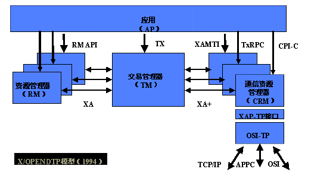

# 分布式系统事务一致性解决方案 #

## 开篇 #

### 在OLTP系统领域，我们在很多业务场景下都会面临事务一致性方面的需求，例如最经典的Bob给Smith转账的案例。传统的企业开发，系统往往是以单体应用形式存在的，也没有横跨多个数据库。我们通常只需借助开发平台中特有数据访问技术和框架（例如Spring、JDBC、ADO.NET），结合关系型数据库自带的事务管理机制来实现事务性的需求。关系型数据库通常具有ACID特性：原子性（Atomicity）、一致性（Consistency）、隔离性（Isolation）、持久性（Durability）。而大型互联网平台往往是由一系列分布式系统构成的，开发语言平台和技术栈也相对比较杂，尤其是在SOA和微服务架构盛行的今天，一个看起来简单的功能，内部可能需要调用多个“服务”并操作多个数据库或分片来实现，情况往往会复杂很多。单一的技术手段和解决方案，已经无法应对和满足这些复杂的场景了。#

## 分布式系统的特性 #

### 对分布式系统有过研究的读者，可能听说过“CAP定律”、“Base理论”等，非常巧的是，化学理论中ACID是酸、Base恰好是碱。这里笔者不对这些概念做过多的解释，有兴趣的读者可以查看相关参考资料。CAP定律如下图： #

### 在分布式系统中，同时满足“CAP定律”中的“一致性”、“可用性”和“分区容错性”三者是不可能的，这比现实中找对象需同时满足“高、富、帅”或“白、富、美”更加困难。在互联网领域的绝大多数的场景，都需要牺牲强一致性来换取系统的高可用性，系统往往只需要保证“最终一致性”，只要这个最终时间是在用户可以接受的范围内即可。 #

## 分布式事务 #

### 提到分布式系统，必然要提到分布式事务。要想理解分布式事务，不得不先介绍一下两阶段提交协议。先举个简单但不精准的例子来说明： #

### 第一阶段，张老师作为“协调者”，给小强和小明（参与者、节点）发微信，组织他们俩明天8点在学校门口集合，一起去爬山，然后开始等待小强和小明答复。第二阶段，如果小强和小明都回答没问题，那么大家如约而至。如果小强或者小明其中一人回答说“明天没空，不行”，那么张老师会立即通知小强和小明“爬山活动取消”。细心的读者会发现，这个过程中可能有很多问题的。如果小强没看手机，那么张老师会一直等着答复，小明可能在家里把爬山装备都准备好了却一直等着张老师确认信息。更严重的是，如果到明天8点小强还没有答复，那么就算“超时”了，那小明到底去还是不去集合爬山呢？这就是两阶段提交协议的弊病，所以后来业界又引入了三阶段提交协议来解决该类问题。两阶段提交协议在主流开发语言平台，数据库产品中都有广泛应用和实现的，下面来介绍一下XOpen组织提供的DTP模型图： #

